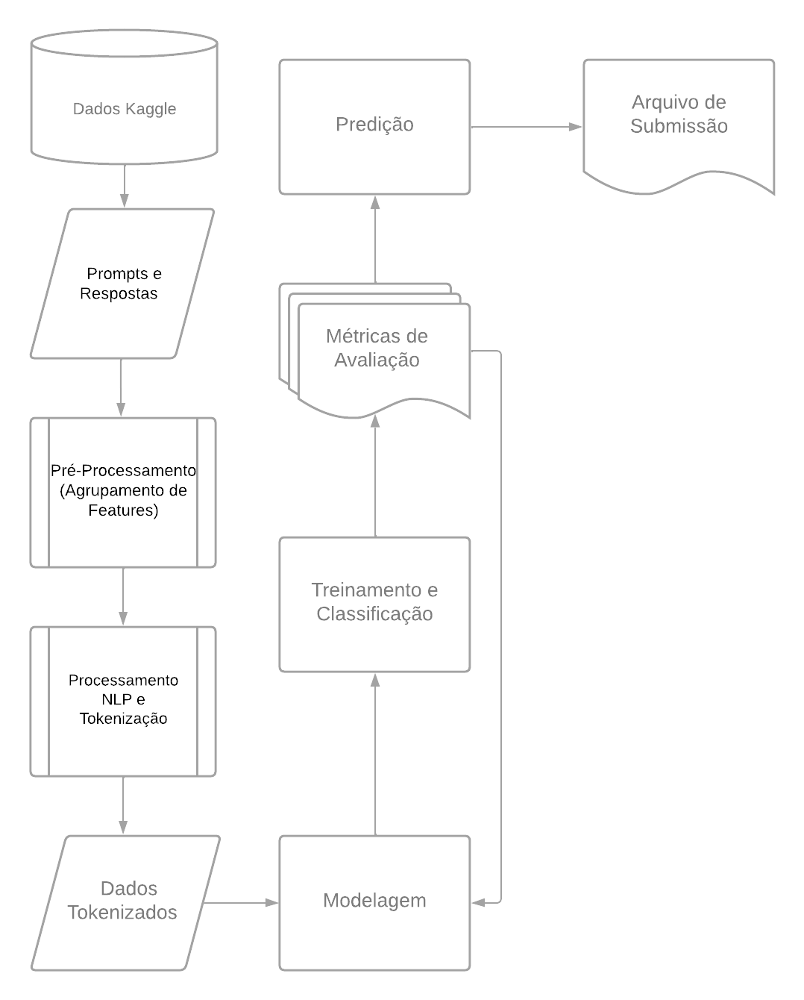

Projeto LMSYS
================
## Descrição
Esse projeto trata-se na verdade de uma competição no Kaggle, cujo objetivo é dada uma base de dados que contém diversos prompts de conversas com modelos de IA, decidir qual obteve a melhor resposta, em questão de qual o usuário iria preferir, podendo também ocasionar em um possível empate.

## Dados
Segundo a própria descrição do desafio, os dados são compostos pelas seguintes colunas:
*   id - A unique identifier for the row.
*   model_[a/b] - The identity of model_[a/b]. Included in train.csv but not test.csv.
*   prompt - The prompt that was given as an input (to both models).
*   response_[a/b] - The response from model_[a/b] to the given prompt.
*   winner_model_[a/b/tie] - Binary columns marking the judge's selection. The ground truth target column.

## Objetivo
O objetivo é criar um modelo que consiga prever qual modelo de IA teve a melhor resposta, ou se houve um empate, baseando-se nas respostas dadas por ambos os modelos.

### Métodos Planejados e Utilizados
#### Análise Exploratória
Primeiramente, o ideal é fazer uma análise exploratória dos dados, para o melhor entendimento, como a quantidade de vitórias, empates, e derrotas de cada modelo, e a quantidade de prompts que cada modelo respondeu.
Com isso, podemos ter uma ideia de como os dados estão distribuídos, e se há algum desbalanceamento nos dados, alguma possível tendência, ou algum padrão que possa ser explorado.

#### Contexto
Com isso um tratamento de dados se faz necessário, é válido a utilização da estratégia de Unificar o contexto da Pergunta-Resposta para extrairmos os tokens mais relevantes.
Esses tokens serão utilizados para treinar um modelo de classificação, que irá prever qual modelo teve a melhor resposta, ou se houve um empate.

#### Tokenização 
Para a tokenização, utilizaremos o BertTokenizer, que é um tokenizador do modelo BERT, que é um modelo de linguagem desenvolvido pelo Google, que é um dos modelos estado-da-arte em NLP. O BertTokenizer funciona da seguinte forma:
Suponha que temos a seguinte frase: "O rato roeu a roupa do rei de Roma"
O BertTokenizer irá tokenizar essa frase da seguinte forma:
```
['O', 'rato', 'ro', '##eu', 'a', 'roupa', 'do', 'rei', 'de', 'Roma']
```
O ## indica que a palavra é uma continuação da palavra anterior, isso é feito para que o modelo consiga capturar o contexto da palavra, mesmo que ela seja dividida em tokens! 

##### Por que BERT?
BERT é um modelo de linguagem baseado em transformer que consegue capturar o contexto de uma palavra em uma frase, ele é um modelo pré-treinado, que consegue ser utilizado para diversos tipos de tarefas em NLP, como classificação de texto, extração de entidades, entre outros. Para esse problema de captura de contexto e relevância de respostas, o BERT é uma ótima escolha, suas variações como o DistilBERT (mais leve, cerca de 40% a menos parâmetros), o RoBERTa (treinado em mais dados, ajuste de hiperparâmetros e tokenização), e o ALBERT (mais eficiência de parâmetros), também são boas escolhas, mas pra esse problema, o BERT é uma escolha sólida.

#### Modelo de Classificação
O modelo de classificação que será utilizado é o BertForSequenceClassification, que é um modelo de classificação de sequências, que utiliza o modelo BERT como base, ele será treinado com os tokens extraídos do contexto da pergunta-resposta.

### Pós-Modelagem
Após a modelagem, será feita uma análise dos resultados, e se necessário, será feito um ajuste fino dos hiperparâmetros, para melhorar a performance do modelo.
Como solicitado no desafio, será feito um arquivo de submissão, com as previsões do modelo pra o conjunto de teste, presente em test.csv. 
Dependendo do formato da saída, será feita um adaptação para o formato correto, e então será feito o envio do arquivo de submissão.


### Considerações Finais
Como o desafio é uma competição no Kaggle, é importante que o modelo tenha uma boa performance, para isso que ocorra, será feito um ajuste dos hiperparâmetros, e se necessário, mais ajustes nos dados, para que o modelo tenha a melhor performance possível.

### Workflow
